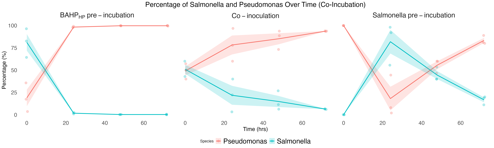
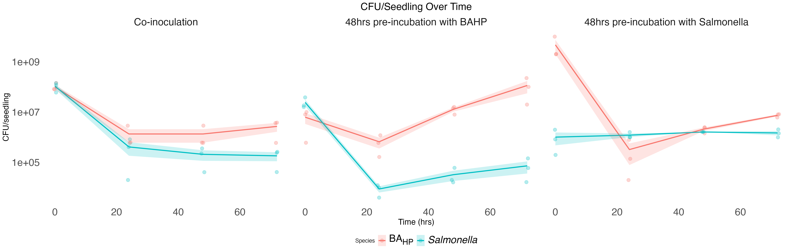

# Figure 2 - Bacterial Competition Analysis

This directory contains R scripts and data for generating Figure 2 plots.


## Files

- `All_data_Sal_treated.xlsx` - Excel data file with experimental results across 3 experiments
- `Percentage script_with individual points.R` - Generates percentage plots over time with error bars
- `cfu.seedling_with individual points_script.R` - Creates CFU/seedling visualizations with log scale

## Prerequisites

To install the required libraries, you can run:

```bash
# From the ../utils directory
Rscript ../utils/install_depencencies.R
```

## Generating the Plots

Navigate to the Figure 2 directory and run the scripts:

```bash
# Ensure you are in ./Figure 2/

# Generate percentage over time plot
Rscript "Percentage script_with individual points.R"

# Generate CFU per seedling plot  
Rscript "cfu.seedling_with individual points_script.R"
```

## Output Files

The scripts will generate the following plot files:

- `percentage_overtime.png` - Percentage analysis over time with individual data points and error bars


- `cfu_seedling_over_time.png` - CFU per seedling visualization with log scale transformation



## Data Structure

The Excel file contains experimental data with multiple conditions:
- Co-inoculation
- BAHP pre-incubation  
- Salmonella pre-incubation

Data includes CFU counts and percentages for bacterial competition analysis across time points with biological replicates.
